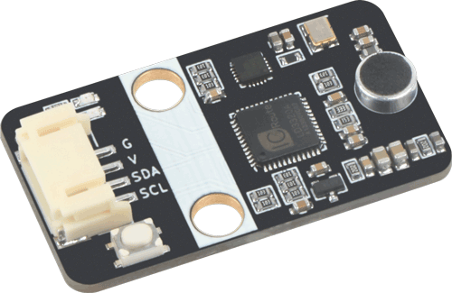

# MakeCode Extension for Emakefun Speech Recognizer

## Introduction

- This project implements a MakeCode extension for Microsoft to integrate the Emakefun speech recognition module's capabilities on the micro:bit.

- Through this extension, you can easily use the Emakefun speech recognizer to add voice commands and get recognition results in the MakeCode Blocks editor.

## Usage

- Use the createSpeechRecognizer block to create an instance of the speech recognizer and configure the I2C address.

- Use the addSpeechCommand block to add voice commands to recognize and index numbers.

- In a loop, use the recognizedSpeechIndex block to get the recognition result. A return value of -1 means no speech command was recognized. Only a return index >= 0 indicates successful recognition.

- Based on the return value of recognizedSpeechIndex, perform appropriate actions - for example, display the index when >= 0 to show the recognized speech command.

## Hardware



## Example

You can copy the code from below or view the project (blocks and JavaScript view) [here](https://makecode.microbit.org/_7fTL9aDeWJfc).

```blocks
let recognized_speech_index = 0
let speech_recognizer = Emakefun.createSpeechRecognizer(48)
speech_recognizer.addSpeechCommand(0, 'bei jing')
speech_recognizer.addSpeechCommand(1, 'shang hai')
speech_recognizer.addSpeechCommand(2, 'cheng du')
basic.forever(function() {
  recognized_speech_index = speech_recognizer.recognizedSpeechIndex()
  if (recognized_speech_index != -1) {
    basic.showNumber(recognized_speech_index)
  }
})
```

## Supported targets

- for PXT/microbit
(The metadata above is needed for package search.)

## License

MIT
